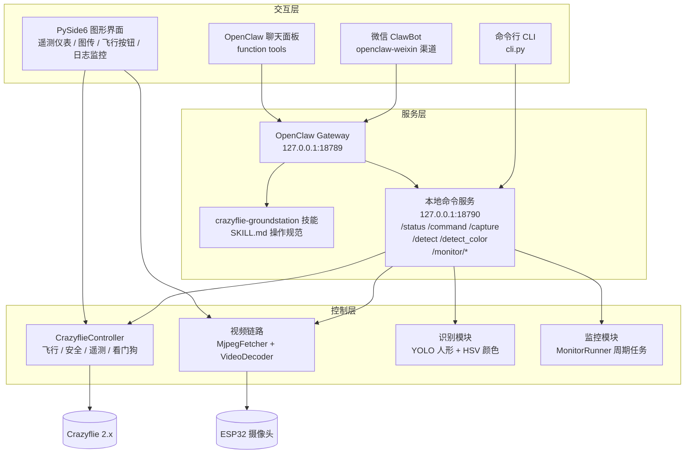
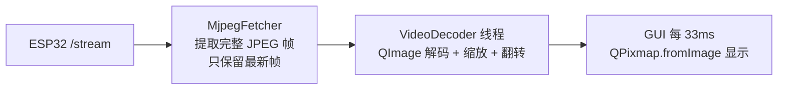
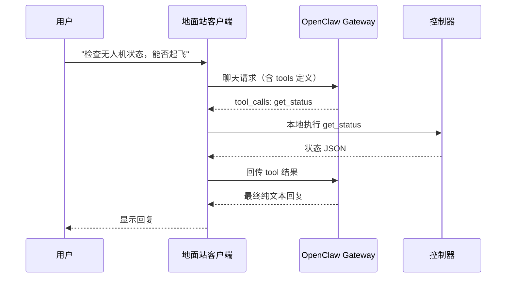
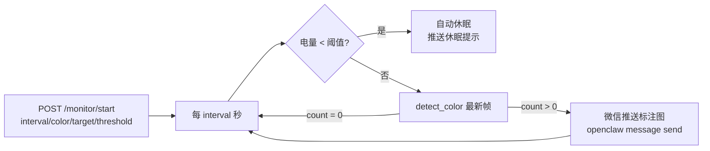
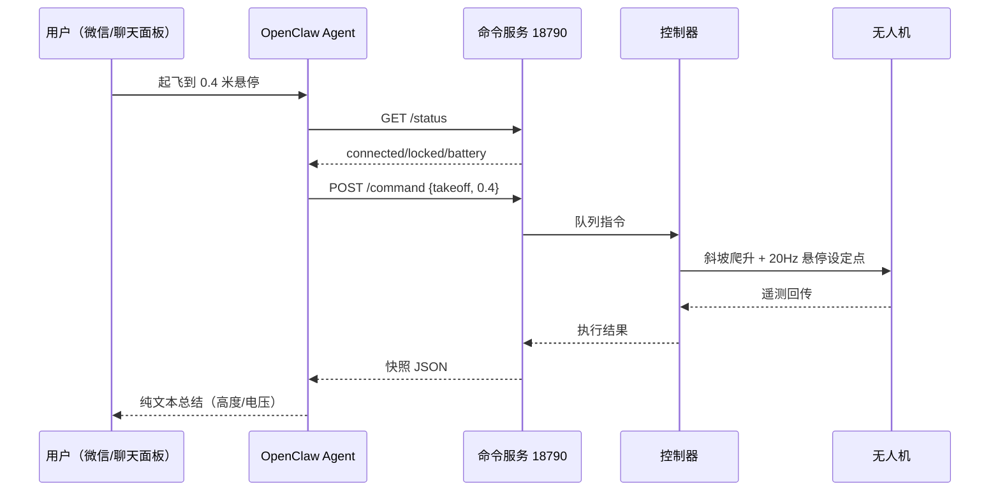

# 无人机智能地面站 · 项目设计说明（开题报告）

> 本文档描述 Crazyflie QT 地面站的**总体架构、核心原理与工作流程**，
> 不含配置步骤（配置与操作见 `README-zh.md`）。

---

## 1. 项目背景与意义

小型开源无人机（Crazyflie 2.x）是室内无人机科研与教学的常用平台。现有
无人机控制方案通常依赖一套完整的网页服务链（前端 + 后端 + 媒体服务器 +
IM 网关 + 数据库），链路长、组件多、部署重，且大多只能通过界面按钮或
脚本操作，缺乏"自然语言指挥"能力。

本项目开发一套**独立的桌面地面站**，具备三个特点：

1. **轻量直连**：通过 Crazyradio PA + cflib 直接与无人机建立无线链路，
   不依赖任何网页服务，单机即可完成连接、遥测、飞行控制与图传显示。
2. **可对话**：集成 OpenClaw 智能体，把无人机操作暴露为标准 function
   tools 与技能（skill），支持在聊天面板、命令行、甚至微信中直接下达
   自然语言指令。
3. **可感知**：本地运行 YOLO 人形检测与 HSV 颜色检测，支持"识别可疑
   人员""识别红色物块"等视觉任务，并可启动持续监控任务（周期性检测、
   命中即推送、低电量自动休眠）。

## 2. 研究目标与内容

### 2.1 目标

构建一套安全、可对话、可感知的桌面无人机地面站，实现从"手动点击按钮
遥控"到"自然语言 + 视觉自主感知"的升级。

### 2.2 研究内容

| 内容 | 说明 |
|---|---|
| 无线连接与飞行控制 | CRTP 链路、遥测订阅、悬停/移动/起降控制、旋翼测试 |
| 飞行安全机制 | LOCKED 保护、电池阈值、运动看门狗、双通道急停、断链检测 |
| 实时图传 | ESP32 MJPEG 拉流、后台解码、GUI 低开销显示 |
| 智能体指挥 | OpenClaw function tools、工具执行循环、技能系统、多渠道 |
| 视觉识别 | 本地 YOLO 人形检测、HSV 颜色物块检测、标注图生成 |
| 持续监控 | 周期检测任务、命中即推送、低电量自动休眠 |

## 3. 系统总体架构

地面站采用**三层架构**：交互层（人与系统的各种入口）、服务层（智能体
与本地 API）、控制层（无线电、视频、检测、监控等硬件相关能力）。



### 3.1 模块清单

| 模块 | 职责 |
|---|---|
| `main.py` | GUI 入口，装配控制器/视频/检测/监控/命令服务 |
| `cli.py` | 无界面命令行（status/takeoff/land/move/estop/spin-test/serve） |
| `app/controller.py` | 核心：无线电连接、飞行指令、遥测、安全机制 |
| `app/command_server.py` | 本地 HTTP JSON API（供 OpenClaw/脚本调用） |
| `app/agent_tools.py` | OpenClaw function tools 定义与本地执行器 |
| `app/openclaw_client.py` | 聊天客户端（SSE 流式 + 工具执行循环） |
| `app/video.py` | MJPEG 拉流与后台解码线程 |
| `app/detector.py` | YOLO 人形检测 + HSV 颜色检测 |
| `app/monitor.py` | 持续监控任务（周期检测/推送/低电量休眠） |
| `app/ui/` | PySide6 界面（仪表、轨迹、视频、日志监控） |
| `skills/crazyflie-groundstation/` | OpenClaw 技能（操作规范与安全规则） |

## 4. 核心技术原理

### 4.1 无人机通信与飞行控制

#### 无线链路

无人机通过 **Crazyradio PA**（2.4GHz USB 无线电棒）与电脑通信，协议为
Bitcraze 的 **CRTP**（Crazy RealTime Protocol）。在 WSL 环境下，USB
设备通过 `usbipd` 从 Windows 附加到 Linux，再由 cflib 的 RadioDriver
驱动。

每个 Crazyradio 同一时间只能被一个程序占用，因此地面站采用**单一
worker 线程**持有 `SyncCrazyflie` 上下文——cflib 对象非线程安全，所有
对无线电的操作都收敛到该线程，通过线程安全队列接收外部指令。

#### 指令模型

```mermaid
flowchart LR
    REQ[request(action, **kw)] --> Q{紧急?}
    Q -- estop/stop --> UQ[紧急队列<br/>最高优先级]
    Q -- 其他 --> NQ[普通队列]
    UQ --> W[worker 线程<br/>每 5ms 轮询]
    NQ --> W
    W --> CF[SyncCrazyflie 上下文]
```

- **普通指令**（takeoff/land/hover/move/spin_test）进入普通队列，按序执行；
- **紧急指令**（stop/estop）进入独立高优先级队列，worker 每个泵循环先
  处理紧急队列，保证"急停永不排队"；紧急指令还会清空普通队列，防止
  排队中的起飞指令在急停后重新武装电机。

#### 飞行控制细节

- 本机无人机使用**自定义 CRTP v6 固件**，武装（arming）的唯一开关是
  `system.arm` 参数；cflib 的标准武装请求被固件忽略。
- 高度保持使用 `TYPE_HOVER_LEGACY` 悬停设定点，以 **20 Hz** 泵送
  （`send_hover_setpoint`）。
- 起飞 = 从 0 到目标高度做斜坡爬升（约 3 s）；降落 = 反向斜坡降至 0，
  并在 z=0 保持约 2 s 再切电机——避免降落过猛触发固件 LOCKED 保护。
- 旋翼测试通过 `motorPowerSet.m1..m4` 参数逐个慢速驱动（约 6% 功率），
  测试结束在 `finally` 中确保所有电机过载被清除。

### 4.2 飞行安全机制

安全是地面站的核心设计约束，共七层：

| 层级 | 机制 | 原理 |
|---|---|---|
| 1 | LOCKED 保护 | 固件 `supervisor.info` 第 6 位指示上次飞行异常断电；置位时拒绝起飞，只能断电重启解除 |
| 2 | 电池阈值 | 起飞前检查 `pm.vbat`：低于 3.7 V 拒绝起飞；低于 3.8 V 告警 |
| 3 | 运动看门狗 | 飞行中若 0.5 s 没有新移动指令，自动回到悬停，防止指令丢失后漂移 |
| 4 | 双通道急停 | estop/stop 走高优先级队列，即使正在执行长移动也立即生效并清空普通队列 |
| 5 | 断链检测 | 订阅 cflib `connection_lost` / `disconnected` 回调；另设遥测看门狗（3.5 s 无遥测判掉线）；掉线即置未连接并安全重连 |
| 6 | 重连超时保护 | 连接阶段 15 s 硬超时，杜绝无线电驱动卡死阻塞 worker |
| 7 | 独占无线电 | 同一时刻只允许一个进程使用无线电，运行前检查 bridge/GUI/CLI 冲突 |

### 4.3 遥测链路

通过 cflib `LogConfig` 订阅四组遥测：

| 配置 | 频率 | 内容 |
|---|---|---|
| 位置 | 100 ms | stateEstimate.x/y/z |
| 姿态 | 100 ms | stabilizer.roll/pitch/yaw |
| 电池 | 1000 ms | pm.vbat |
| 状态 | 100 ms | supervisor.info（LOCKED 位） |
| 链路 | 200 ms | crtp.link_quality |

回调线程把数据写入带锁的快照字典，GUI 主线程每 100 ms 读取并刷新仪表，
互不阻塞。

### 4.4 实时图传

ESP32 摄像头输出 MJPEG 流（320×240）。图传链路分三段，**解码与缩放
全部在后台线程**，GUI 主线程只做显示：



- 拉流线程逐块读取数据，按 JPEG 的 SOI/EOI 标记切帧，**只保留最新帧**
  （丢帧策略，避免积压）；
- 缓冲区设 2 MB 上限，防止损坏流无限增长；
- 显示帧率上限约 30 fps，与遥测刷新（100 ms）相互独立。

### 4.5 OpenClaw 智能体集成（核心创新）

#### 动机

传统方式把无人机接口写进 system prompt 让大模型"照着拼 curl"，结果
模型自由发挥、指令遵循差、输出 Markdown。本项目改为**结构化工具 +
技能**双机制。

#### 机制一：function tools（聊天面板/地面站客户端）

地面站把无人机操作定义成 8 个标准 OpenAI function tools：

| 工具 | 参数 | 说明 |
|---|---|---|
| get_status | — | 连接/锁定/电池/位置/姿态/链路质量 |
| takeoff | height | 起飞并悬停 |
| land | — | 受控降落 |
| hover | — | 悬停 |
| stop / estop | — | 立即切电机（空中坠落，紧急用） |
| move | vx/vy/vz/yawrate/duration | 速度移动（duration ≤ 2 s） |
| spin_test | power/duration | 旋翼逐个慢速测试 |

客户端实现**工具执行循环**：



模型只负责"决策调用哪个工具"，执行永远由地面站本地完成，结果以 JSON
回传，杜绝模型杜撰接口。

#### 机制二：技能（微信/无工具渠道）

微信渠道的 agent 运行在 Gateway 侧，没有地面站客户端传入的 tools，因此
技能 `crazyflie-groundstation/SKILL.md` 提供：

- **HTTP 接口操作规范**：curl 调用 `127.0.0.1:18790` 的 status/command；
- **安全规则**：起飞前查状态、move 限时、结束必须 land、异常立即 estop；
- **响应格式**：纯文本、禁 Markdown、只报可读摘要；
- **任务规范**：截图发图、识别人员、识别彩色物块、持续监控的调用方式。

#### 模型

默认模型为 DeepSeek V4 Flash（OpenAI 兼容），通过 Gateway 的
`/v1/chat/completions` 端点提供服务，支持函数工具契约。

### 4.6 视觉识别

#### YOLO 人形检测

使用 ultralytics YOLOv8n（COCO 80 类预训练）本地 CPU 推理：

- 输入：摄像头最新帧（`/capture` 同一来源）；
- 输出：人数、每个人 bbox 与置信度、画框标注图（JPEG）；
- 通过 `POST /detect` 暴露，标注图落盘供 agent 直接发送。

#### HSV 颜色物块检测

COCO 模型不含"红色物块"等自定义目标，故实现纯 OpenCV 的颜色分割：

1. 帧转 HSV 色彩空间（对光照更鲁棒）；
2. 按颜色区间生成掩膜（红色双区间 0–10 / 170–180 度）；
3. 形态学开运算去噪；
4. 轮廓查找 + 最小面积过滤，输出 bbox 与面积占比；
5. 标注图生成，通过 `POST /detect_color` 暴露（支持 red/green/blue）。

### 4.7 持续监控任务

针对"每 30 秒检测一次、识别到才通知、低电量自动休眠"的需求，实现
`MonitorRunner` 后台线程（不占用 agent 会话）：



微信推送复用 OpenClaw 渠道能力：地面站调用
`openclaw message send --channel openclaw-weixin --to <用户ID> --media <图>`，
实现"识别到才打扰用户"。

### 4.8 微信渠道

通过 `openclaw-weixin` 插件（腾讯 iLink Bot API）接入微信 ClawBot：

- 微信私信经插件轮询 iLink API 进入 Gateway，路由到默认 agent；
- 首次使用需配对授权（`openclaw pairing approve`）；
- 支持文本与媒体（图片）；agent 可通过消息工具向会话用户发图；
- 与地面站本地服务协作：微信指令 → agent 调 `127.0.0.1:18790` → 无人机
  执行 → 遥测/图片回传微信。

## 5. 典型工作流程

### 5.1 自然语言指挥飞行



### 5.2 截图 / 识别 / 监控

- **截图**：agent `GET /capture` 取最新帧 → 消息工具发图；
- **识别人员**：agent `POST /detect` → 拿人数/标注图 → 发图 + 报告；
- **识别物块**：agent `POST /detect_color` → 发标注图 + 数量；
- **持续监控**：agent `POST /monitor/start` → 后台周期检测 → 命中才推送
  → 低电量自动休眠。

## 6. 技术选型

| 组件 | 选型 | 理由 |
|---|---|---|
| GUI 框架 | PySide6 (Qt) | 跨平台、信号槽、图表绘制方便 |
| 无人机 SDK | cflib | Crazyflie 官方 Python 库 |
| 通信 | CRTP / Crazyradio PA | 官方无线链路 |
| 图传 | ESP32 MJPEG + OpenCV | 轻量、零编解码依赖 |
| 智能体 | OpenClaw Gateway | 多渠道（微信）、技能系统、函数工具契约 |
| 大模型 | DeepSeek V4 Flash | OpenAI 兼容、本地网关、成本低 |
| 视觉 | ultralytics YOLOv8n / OpenCV | 本地推理、COCO 预训练、无云依赖 |
| USB 桥接 | usbipd + WSL | Windows 主机接入 Linux 驱动链 |

## 7. 项目特色与创新点

1. **工具化智能体集成**：无人机操作是结构化 function tools + 客户端执行
   循环，而非提示词模板，指令遵循率与响应速度显著提升。
2. **技能驱动可扩展**：操作规范沉淀为 SKILL.md，新增能力（截图/识别/
   监控/定时任务）只需扩展技能与本地接口，不改核心。
3. **纵深安全设计**：固件 LOCKED + 电池阈值 + 看门狗 + 双通道急停 +
   断链重连，七层防护贯穿控制链路。
4. **全本地化**：模型、识别、服务全部在本机运行，不依赖公有云，适合
   室内/教学场景。
5. **多渠道统一指挥**：GUI 聊天、命令行、微信 ClawBot 共用同一套
   控制器与安全模型。

## 8. 实验验证方案

| 验证项 | 方法 | 通过标准 |
|---|---|---|
| 飞行控制 | 起降/悬停/移动/旋翼测试 | 指令执行正确、无 LOCKED |
| 安全 | 飞行中断电、急停、低电量 | 状态正确翻转、不失控、界面不卡 |
| 图传 | 视频流稳定显示 | 无积压、界面流畅（后台解码） |
| 智能体 | 聊天指挥多轮任务 | 工具调用正确、纯文本回复 |
| 微信 | 微信指挥 + 图片回传 | 消息/图片收发正常 |
| 视觉 | 人形/红色物块识别 | 检测数量与标注图正确 |
| 监控 | 周期检测 + 低电量休眠 | 命中才推送、休眠自动触发 |

## 9. 总结与展望

本项目以"轻量、安全、可对话、可感知"为设计目标，构建了独立的 Crazyflie
桌面地面站，完成了飞行控制、安全机制、图传、智能体指挥、视觉识别与
持续监控的闭环。

后续可扩展方向：

- 训练专用 YOLO 模型（如"红色物块""可疑人员"定制目标），替代通用
  COCO 模型与颜色分割；
- 多无人机协同监控与任务规划；
- 更多渠道接入（飞书、钉钉、网页端）与语音控制；
- 基于监控事件的任务编排（识别到目标后自动跟随/悬停告警）。
