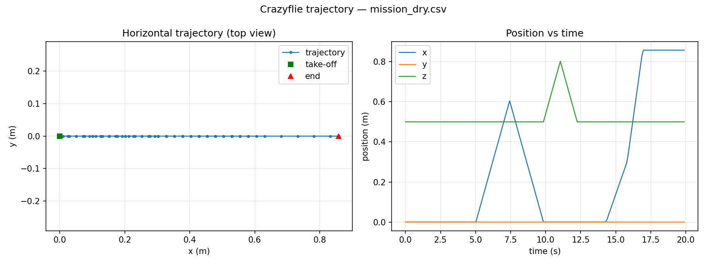

# 002 · Day-1 总结：Crazyflie 无人机开发与调试

> 本文是按《constrain/constrain.md》要求写的每日总结草稿。
> **使用前请逐段 review**：补充你自己的理解、实际测量数据、遇到的问题与照片。
> AI 只负责搭框架，不替代你的"理解"。

## 一、今日目标（对应 introduction 第一天）

1. 搭建 crazyflie + ESP-IDF 开发环境
2. 熟悉 crazyflie 硬件结构（飞控/传感器/无线）的拆装
3. 编译并烧录基础固件
4. 用 Python 连接无人机，接收飞行参数（高度/速度/方向），控制运动

## 二、已完成内容

### 1. 开发环境（已完成，自动）
按 introduction.md 第 4 节「环境版本基线(2026-08-04)」对齐：
- Python **3.12.10**（新装，per-user），venv 隔离环境建在 `src/day1_crazyflie/.venv/`。
- venv 内安装 `cflib==0.1.32` + `cfclient==2026.4`（与官方固件 `2026.04` 配套），依赖用清华 PyPI 镜像。
- 验证：venv 下全部脚本编译通过、`--dry` 仿真运行通过；`cfclient` 能正常启动。
- ESP-IDF **v5.5.5**（LTS）：正在后台 `git clone -b v5.5.5 --recursive` + `install.ps1` 安装中。

### 2. 代码（已写并通过仿真验证，真机待硬件）
所有代码在 `src/day1_crazyflie/`：

| 脚本 | 作用 | 对应验收 |
|------|------|----------|
| `01_connect_test.py` | 扫描/连接/读取参数 | 基础·连接 |
| `02_telemetry.py` | 实时高度/速度/方向(yaw)/电压 + CSV | 基础·接收飞行参数 |
| `03_takeoff_hover_land.py` | 起飞→悬停≥10s→降落，打印漂移 | 基础·60 |
| `04_flight_mission.py` | 虚拟围栏内全套飞行动作 + 轨迹CSV | 进阶·80 |
| `05_plot_trajectory.py` | 轨迹画图 | 写总结/论文 |
| `sim.py` / `virtual_fence.py` / `telemetry.py` / `cf_utils.py` | 仿真 / 围栏 / 遥测 / 公共工具 | —— |

**仿真结果**（`python 04_flight_mission.py --dry`，无硬件）：
- 全部动作按序执行：起飞→悬停→前进0.6m→后退0.6m→上升0.3m→下降0.3m→左转90°→右转90°→加减速剖面→降落。
- 围栏自动收紧生效：加减速阶段 0.5 m/s 段从 1.5s 被围栏压到 1.1s，防止撞边界（终点 x=0.86m < 边界 0.85m，见下图）。
- 围栏看门狗单元测试通过：位置越界后 0.1s 内触发急停。

### 3. 设计要点（写论文可展开）
- **虚拟围栏两层保护**：① 每次平移前 `clamp_displacement` 收紧位移，目标点必在边界内；② 后台 `FenceMonitor` 线程盯位置，越界立即急停。这不依赖 GPS，Crazyflie 无 GPS。
- **无 Flow deck 的退化方案**：x/y 估计不可信时，积分 `stateEstimate.vx/vy` 得到伪位置，围栏仍按最好努力生效；有 Flow deck 时 `--flow` 直接用实测位置。
- **机体/世界系坐标变换**：`world_to_body()` 保证"朝期望世界方向飞"，转弯后方向语义仍然正确。
- **可复现实验**：`--dry` 仿真 + CSV 轨迹 + 画图，为后面 Experiments 章节留下对比基准（仿真 vs 真机）。

## 三、需要手工完成的步骤（已暂停，待硬件）

- [ ] **A 硬件拆装**：认识飞控(STM32+nRF51+IMU)/电机/电池；装桨叶保护罩。
- [ ] **B Crazyradio 驱动**：Zadig 装 libusb-win32，插上无人机后 `01_connect_test.py` 能扫到。
- [ ] **C 固件**：cfclient → Connect → Bootloader 刷官方 `crazyflie-firmware-2026.04.zip`（`cf2` 平台）。
- [ ] **D 基础验收**：`03_takeoff_hover_land.py --hover 12`，悬停≥10s 无明显漂移（漂移大→加 Flow Deck v2）。
- [ ] **E 进阶验收**：`04_flight_mission.py --csv mission.csv`，飞完画图。
- [ ] **F 卓越准备**：安装 ESP-IDF（步骤见 `src/day1_crazyflie/README.md` 第 7 节）。

## 四、遇到的问题 & 解决（待真机时补充）

- [ ] 记录首次连接失败现象 → 排查驱动/信道/地址。
- [ ] 记录悬停漂移数值 → 决定是否加 Flow deck。

## 五、下一步（展望/为论文铺垫）

1. 真机验证后，用 CSV 对比"仿真轨迹 vs 真机轨迹"，量化围栏保护误差。
2. 探究悬停漂移与电量、环境气流的关系（实验 4 的素材）。
3. 为 Day-2（Openclaw 通信）准备好 Python 连接层 —— 今天的 `cf_utils.py` 可直接复用。
